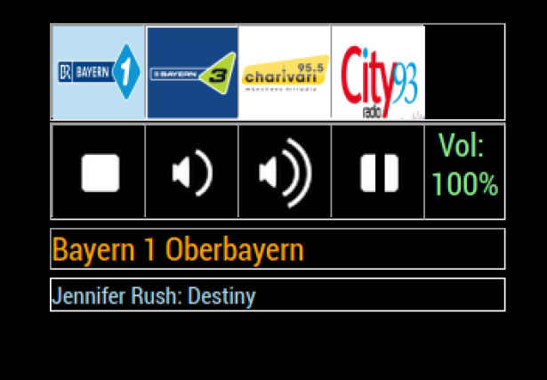

# MMM-MyRadio
Radio Module for MM showing sender, RDS data and Soundvolume information



## IMPORTANT!

This module requires that you have mpg123 installed.
To install it run : sudo apt-get install mpg123 
Make sure that all scripts in "scripts" folder are set as executable!!!
Each system has its own audio config so i put 2 examples and a docu into the "Audio Examples" folder.
If u found a new one for ur system feel free to tell me.

## How it works

The module plays up to 5 diff. Radiostations and if they show sender and RDS data also, u can select the station and the volume 
with ur mouse, touchpad or touchscreen, now also via MMM-voice.

The module is based on the idea and code of MMM-TouchPlayerBasic by Pierre Broberg

## Installation

* sudo apt-get install mpg123
* git clone https://github.com/tbbear/MMM-MyRadio into the `~/MagicMirror/modules` directory.

Make sure that all scripts in "scripts" folder are set as executable!!!

## Config.js entry and options

````javascript
{
	module: 'MMM-MyRadio',
		position: 'top_left',
		config: {
			stations: [
				"yourstation yourstation", // Separation by space, First part "yourstation" is the .png image filename, the second is .sh script name
				// ...up to 5 stations
				],
			autoplay: false, // if true, radio starts playing first channel when MagicMirror starts
			volume: "100%", // enter a default start volume
			showControls: true // if true, controls are shown on the mirror (radio can still be controlled by remote, if set to false)
		}

},
````

## Description

The volume and mute buttons are executing commands for the main ALSA mixer on your Computer (mainly designed for Ubuntu 17.10 with HDMI audio), for 
all other systems u have to modify the entries in node_helper.js;
This also means that if you have a voice-module that speaks to you or have notification/alarm sounds, you will change the volume of that as well.

mpg123 only supports m3u radio playlists files,
so if your choice of radiostation only has .pls playlists and/or AAC audio files this module won't work.

When you name your stations and playlists in the config, make sure you name your files exactly the same

	For an example:
	if you add "superradio superradio" to the config list
	your .sh file should be named superradio.sh and the Icon superradio.png

all .sh files should be placed in the "scripts" folder.
all .png image files should be placed in the "images" folder.

* Scriptfile .sh
	here is the script file explained :

		sudo killall mpg123  // this is so all previous mpg123 instances are stopped before starting a new one, this prevents multiple stations and files to be played simultaniously

		sleep 0.1 // a short pause between commands is needed for the killall to work

		mpg123 -@ http://streams.br.de/bayern1_2.m3u 2>~/MagicMirror/modules/MMM-MyRadio/RDS.log  // the http://... part is ur radio stream and make sure u always keep the rest as it is

Make sure the .sh script files you create are executable, otherwise the scripts will not run.
To make it executable via the terminal use : chmod +x filename.sh  

* Icons/images .png
	U should add your image file named LOGO.png in the images folder.
	For spacing purposes, the image has to be 60px wide.

* Configuration Example
	Remember the name of your .sh scriptfile should be exactly as the station you put in the config! 

````javascript
      {
	module: 'MMM-MyRadio',
		position: 'top_right',
		config: {
			stations: [
				"Bayern1 Bayern1", 
				"Bayern3 Bayern3",
				"Charivari Charivari",
				"Kos Kos",
				"AB AB"
				],
				autoplay: true,
				volume: "100%",
				showControls: true
		}

      },

````
# V1.02
Added autoplay, volume and showControls configuration parameter

# V1.01
Now ready for MMM-voice with the following commands:
SHOW_RADIO
HIDE_RADIO
NEXT_RADIO
STOP_RADIO
VOLUME_UP
VOLUME_DOWN
VOLUME_MUTE
MIRROR_SLEEP
MIRROR_WAKE
here are the adds for MMM-Voice:
in MMM-voice.js:
````javascript
    voice: {
        mode: 'VOICE',
        sentences: [
            'HIDE MODULES',
            'SHOW MODULES',
            'WAKE UP',
            'GO TO SLEEP',
            'OPEN HELP',
            'CLOSE HELP',
            'HIDE RADIO',
            'SHOW RADIO',
            'RADIO STOP',
	    'NEXT RADIO',
            'VOLUME UP',
            'VOLUME DOWN',
            'VOLUME MUTE',
            'MIRROR SLEEP',
            'MIRROR WAKE'
        ]
    },
and
        else if (notification === 'HIDE_RADIO') {
             this.sendNotification('HIDE_RADIO');
        }
        else if (notification === 'SHOW_RADIO') {
             this.sendNotification('SHOW_RADIO');
        }
        else if (notification === 'NEXT_RADIO') {
             this.sendNotification('NEXT_RADIO');
        }
        else if (notification === 'RADIO_STOP') {
             this.sendNotification('RADIO_STOP');
        }
        else if (notification === 'VOLUME_UP') {
             this.sendNotification('VOLUME_UP');
        }
        else if (notification === 'VOLUME_DOWN') {
             this.sendNotification('VOLUME_DOWN');
        }
        else if (notification === 'VOLUME_MUTE') {
             this.sendNotification('VOLUME_MUTE');
        }
        else if (notification === 'MIRROR_SLEEP') {
             this.sendNotification('MIRROR_SLEEP');
        }
        else if (notification === 'MIRROR_WAKE') {
             this.sendNotification('MIRROR_WAKE');
        }
        this.updateDom(300);
````
and in MMM-voice node_helper.js:
````javascript
        } else if (/(SHOW)/g.test(data) && /(RADIO)/g.test(data)) {
            this.sendSocketNotification('SHOW_RADIO');
        } else if (/(HIDE)/g.test(data) && /(RADIO)/g.test(data)) {
            this.sendSocketNotification('HIDE_RADIO');
        } else if (/(NEXT)/g.test(data) && /(RADIO)/g.test(data)) {
            this.sendSocketNotification('NEXT_RADIO');
        } else if (/(RADIO)/g.test(data) && /(STOP)/g.test(data)) {
            this.sendSocketNotification('RADIO_STOP');
        } else if (/(VOLUME)/g.test(data) && /(UP)/g.test(data)) {
            this.sendSocketNotification('VOLUME_UP');
        } else if (/(VOLUME)/g.test(data) && /(DOWN)/g.test(data)) {
            this.sendSocketNotification('VOLUME_DOWN');
        } else if (/(VOLUME)/g.test(data) && /(MUTE)/g.test(data)) {
            this.sendSocketNotification('VOLUME_MUTE');
        } else if (/(MIRROR)/g.test(data) && /(SLEEP)/g.test(data)) {
            this.sendSocketNotification('MIRROR_SLEEP');
        } else if (/(MIRROR)/g.test(data) && /(WAKE)/g.test(data)) {
            this.sendSocketNotification('MIRROR_WAKE');
        }

````
